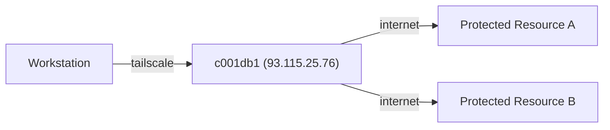

We use tailscale to create a VPN network between our devices. This allows us to
access our devices from anywhere in the world.

# Routing through VPN to external networks

By default only select traffic is routed through the VPN. We use c001db1 as a
static IP address to connect to protected resources for our customers and we
advertise customer networks to the VPN through c001db1 which means clients
using tailscale will automatically connect from the static IP address when
using those resources.



## Add new route

If you want to route a specific network or IP address you have to follow the
steps below.

1. Login to c001db1 and edit `/usr/local/bin/tailscale-advertise-routes.sh`
   adding the network you want to route.
2. Run `tailscale-advertise-routes.sh` on c001db1
3. Open the [tailscale machine settings for c001db1][c001db1] and approve the
   new route under the "Subnets" section.

[c001db1]: https://login.tailscale.com/admin/machines/100.103.106.55

## Setup on c001db1

Enable IP forwarding on c001db1 to allow routing of traffic from the VPN

```bash
echo 'net.ipv6.conf.all.forwarding = 1' | sudo tee -a /etc/sysctl.d/99-tailscale.conf
echo 'net.ipv4.ip_forward = 1' | sudo tee -a /etc/sysctl.d/99-tailscale.conf
sudo sysctl -p /etc/sysctl.d/99-tailscale.conf
```

Added the `/usr/local/bin/tailscale-advertise-routes.sh` script to advertise
routes from this host to the VPN.

Currently the script looks like this:

```bash
#!/usr/bin/env bash

set -eu -o pipefail


tailscale up --advertise-routes="40.113.131.37/32,34.160.111.145/32"
```

Ran `sudo systemctl edit tailscaled` and added the following:

```ini
[Service]
ExecStartPost=/usr/local/bin/tailscale-advertise-routes.sh
```

# Tailscale setup on c001db1, c001db2 and c001db3 hosts

Followed the [tailscale ubuntu 22.04 install
instructions](https://tailscale.com/download/linux/ubuntu-2204)

At the time of writing the command was:

```bash

curl -fsSL https://pkgs.tailscale.com/stable/ubuntu/jammy.noarmor.gpg | sudo tee /usr/share/keyrings/tailscale-archive-keyring.gpg >/dev/null
curl -fsSL https://pkgs.tailscale.com/stable/ubuntu/jammy.tailscale-keyring.list | sudo tee /etc/apt/sources.list.d/tailscale.list

sudo apt-get update
sudo apt-get install tailscale

sudo tailscale up
```

After that, approved the machine in the tailscale admin and disabled key
expiry.

# Sharing ports on linux Machines

This example is setting up port 6379 (*redis*) to be shared on the VPN.

## Setup systemctl unit

To share a port on a linux machine permanently, you have to setup the following
file, after installing tailscale itself.

*File*: `/etc/systemd/system/tailscale-serve-6379.service`

Contents (replacing 6379 port with the port you want to share):
```ini
[Unit]
Description=Tailscale Serve TCP Port 6379
After=network.target

[Service]
Type=simple
ExecStart=/usr/bin/tailscale serve --tcp 6379 6379
Restart=on-failure
User=root

[Install]
WantedBy=multi-user.target
```

## Enable and start the service

```bash
sudo systemctl enable tailscale-serve-6379
sudo systemctl start tailscale-serve-6379
```
