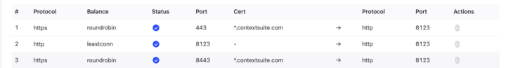
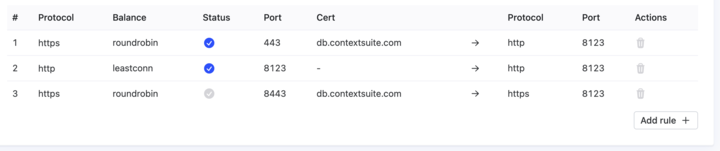

# SSL Certificate Renewal for db.contextsuite.com

## Issue
The SSL certificate for db.contextsuite.com (it was a manually provisioned *.contextsuite.com cert) had expired, causing service disruption.

## Resolution
1. **Installed certbot** on server c001db1
2. **Generated Let's Encrypt certificate** using DNS challenge method:
   - Used `certbot certonly --manual --preferred-challenges dns -d db.contextsuite.com`
   - Added required TXT record to Namecheap DNS
3. **Updated Cherry Server load balancer** with new Let's Encrypt certificate files
4. **Updated the clickhouse config with new cert**
   _I'm not sure this was actually needed, but I did it before realizing that the certs resided in the Cherry Servers LB_.
   The generated certs are owned by root, so I 
     - Copied them to `/etc/clickhouse-server/certs` 
     - Ran `chmod 600` on both
     - Ran `chown clickhouse:clickhouse` on both
     - Updated clickhouse config file: `/etc/clickhouse-server/config.xml` with references to new cets
     - Restarted clickhouse: `systemctl restart clickhouse-server`

   

### Cherry Servers specifics

1. Locate the loadbalancer
2. Add the new certificate
3. Note the existing forwarding rules with the old cert
4. Delete the existing forwarding rules
5. Re-create them using the new cert
6. Delete the old cert

#### Before

#### After

## Result
SSL certificate renewed with 90-day validity from Let's Encrypt, replacing the expired internal CA certificate.